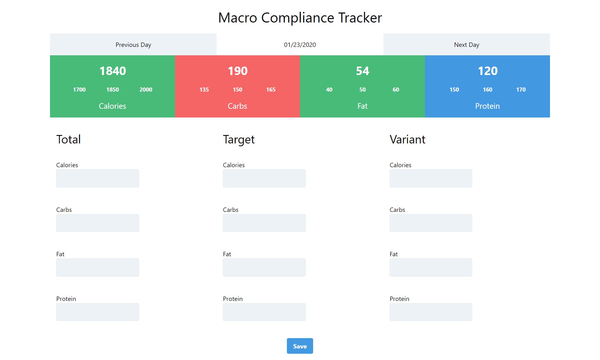

# 👨‍💻 next Macro Compliance Tracker App.
## 📽 A project based on Panacloud React Bootcamp [Project 12F].

### ⚒ Project Demo:
####  For Project Demo Follow the Link For: 
#### Taskbox Site: https://next-compliance-tracker.vercel.app/

### 🕵️‍♂️ Project Details:
####  This project is based on primarily on NextJS, TypeScript as well as uses other libraries too. In this app, you can Trck your macro consumption!

### ⚙ Technical Details:
#### In this project NextJS, MongoDB and TypeScript is used for the project.

### 🤹‍♂️ Skill:
&nbsp;&nbsp;&nbsp;&nbsp;
&nbsp;&nbsp;&nbsp;&nbsp;
&nbsp;&nbsp;&nbsp;&nbsp;
&nbsp;&nbsp;&nbsp;&nbsp;
&nbsp;&nbsp;&nbsp;&nbsp;

### ✔ Contributers:

  <a href="https://github.com/faraasat">
    &nbsp&nbsp&nbsp&nbsp&nbsp&nbsp&nbsp&nbsp&nbsp&nbsp&nbsp&nbsp
  </a>

### 📷 Project UI:

  <a href="https://next-compliance-tracker.vercel.app/">
    &nbsp&nbsp&nbsp&nbsp&nbsp&nbsp&nbsp&nbsp&nbsp&nbsp&nbsp&nbsp
  </a>

